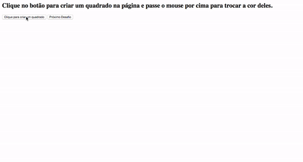
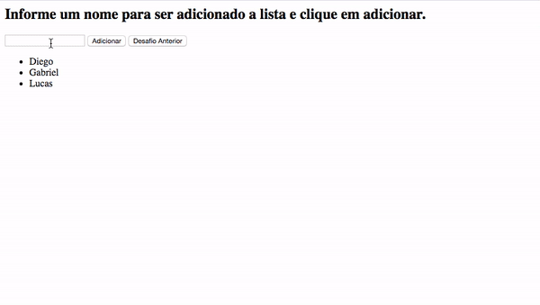

# Desafio JavaScript - Módulo 2

## Github Page com o resultado: https://mbvitoriano.github.io/CursoJavaScript/ 


## Exemplo de Funcionamento



## Exercícios: Módulo 02
### 1º exercício
Crie um botão que ao ser clicado cria um novo elemento em tela com a forma de um quadrado
vermelho com 100px de altura e largura. Sempre que o botão for clicado um novo quadrado deve
aparecer na tela.

### 2º exercício
Utilizando o resultado do primeiro desafio, toda vez que o usuário passar o mouse por cima de
algum quadrado troque sua cor para uma cor aleatória gerada pela função abaixo:
```javascript
function getRandomColor() {
 var letters = "0123456789ABCDEF";
 var color = "#";
 for (var i = 0; i < 6; i++) {
 color += letters[Math.floor(Math.random() * 16)];
 }
 return color;
}
var newColor = getRandomColor(); // #E943F0
```
### 3º exercício
A partir do seguinte vetor:
```javascript
var nomes = ["Diego", "Gabriel", "Lucas"];
```
Preencha uma lista (``` <ul> ```) no HTML com os itens da seguinte forma:
* Diego
* Gabriel
* Lucas

### 4º exercício
Seguindo o resultado do exercício anterior adicione um input em tela e um botão como a seguir:
```html
<input type="text" name="nome">
<button onClick="adicionar()">Adicionar</button>
```
Ao clicar no botão, a função adicionar() deve ser disparada adicionando um novo item a lista de
nomes baseado no nome preenchido no input e renderizando o novo item em tela juntos aos
demais itens anteriores. Além disso, o conteúdo do input deve ser apagado após o clique.
